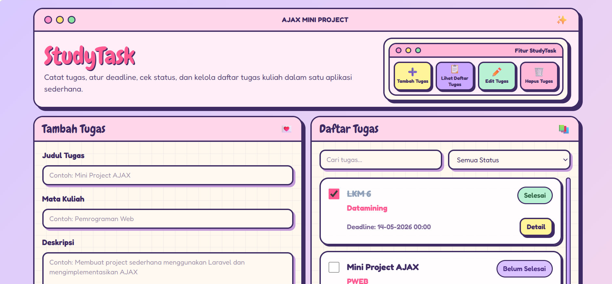
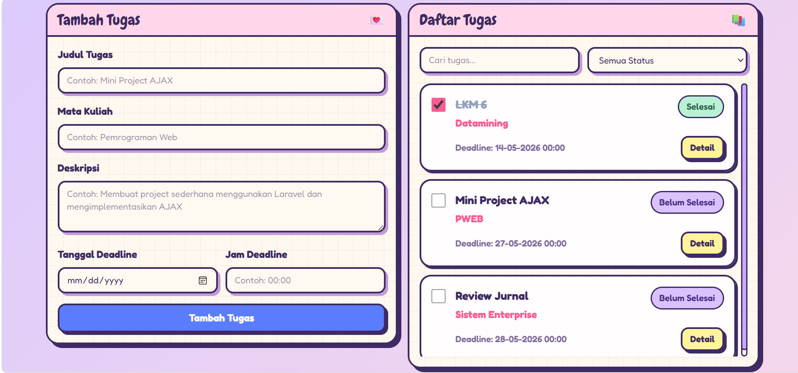
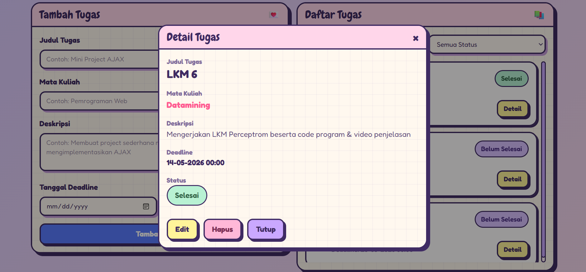

# StudyTask

StudyTask adalah aplikasi web sederhana untuk membantu mahasiswa mencatat, mengatur, dan memantau tugas kuliah. Aplikasi ini dapat digunakan untuk menambahkan tugas, mengatur deadline, melihat status pengerjaan, mengedit data tugas, menghapus tugas, serta mencari dan memfilter daftar tugas.

Aplikasi ini dibuat sebagai simple web application yang menerapkan AJAX agar beberapa proses dapat berjalan tanpa reload halaman.

## Preview Tampilan Website

## Fitur Aplikasi

- Menambahkan tugas kuliah.
- Menampilkan daftar tugas.
- Mengatur deadline berdasarkan tanggal dan jam.
- Mengubah status tugas menjadi selesai atau belum selesai.
- Melihat detail tugas.
- Mengedit data tugas.
- Menghapus data tugas.
- Mencari tugas berdasarkan judul, mata kuliah, atau deskripsi.
- Memfilter tugas berdasarkan status.
- Mengurutkan daftar tugas berdasarkan deadline terdekat.
- Menggunakan AJAX agar proses tambah, edit, hapus, ubah status, search, dan filter berjalan tanpa reload halaman.

## Data yang Dikelola

Aplikasi StudyTask mengelola beberapa data tugas, yaitu:

- Judul tugas
- Mata kuliah
- Deskripsi tugas
- Deadline tanggal
- Deadline jam
- Status tugas

## Teknologi yang Digunakan

- Laravel
- Blade
- Tailwind CSS
- MySQL
- JavaScript Fetch API
- AJAX
- Laragon

## Penerapan AJAX

AJAX diterapkan pada beberapa fitur utama berikut:

### 1. Tambah Tugas

Ketika pengguna menambahkan tugas, data dikirim ke server menggunakan JavaScript `fetch()`. Setelah data berhasil disimpan, tugas langsung muncul di daftar tugas tanpa reload halaman.

### 2. Ubah Status Tugas

Status tugas dapat diubah melalui checkbox. Ketika checkbox dicentang atau dibatalkan, status tugas langsung berubah tanpa memuat ulang halaman.

### 3. Search Tugas

Fitur pencarian berjalan secara langsung. Pengguna dapat mencari tugas berdasarkan judul, mata kuliah, atau deskripsi tanpa reload halaman.

### 4. Filter Status

Daftar tugas dapat difilter berdasarkan status semua, selesai, atau belum selesai. Hasil filter langsung ditampilkan tanpa reload halaman.

### 5. Edit Tugas

Pengguna dapat membuka detail tugas, menekan tombol edit, lalu memperbarui data tugas. Setelah disimpan, tampilan tugas langsung berubah tanpa reload halaman.

### 6. Hapus Tugas

Pengguna dapat menghapus tugas melalui tombol hapus pada modal detail. Setelah berhasil dihapus, tugas langsung hilang dari daftar tanpa reload halaman.

